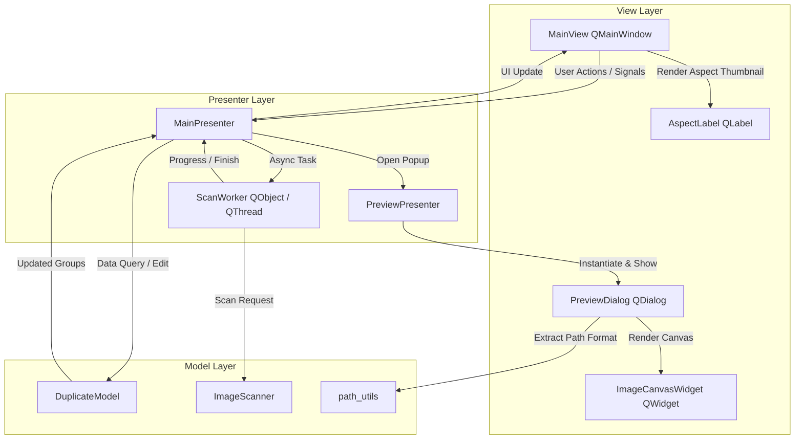
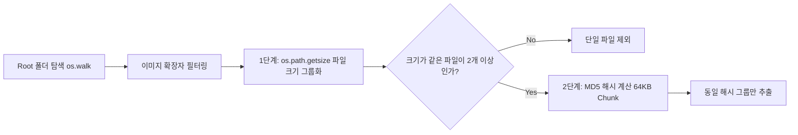
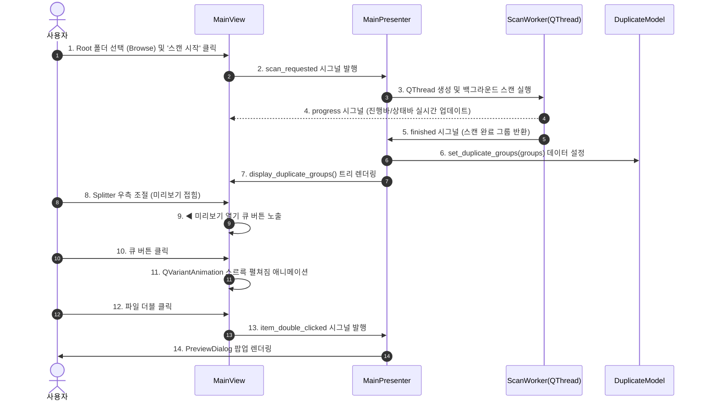

# 중복 이미지 검색 및 관리 프로그램 분석 보고서 (Program Analysis Report)

본 보고서는 PyQt6 기반으로 작성된 **Duplicated Image Finder**의 아키텍처, 디자인 패턴, 세부 모듈, 사용자 인터페이스(UI) 최적화 및 핵심 알고리즘에 대한 종합 분석 결과입니다.

---

## 1. 개요 (Overview)

- **프로그램명**: Duplicated Image Finder (중복 이미지 검색 및 관리 프로그램)
- **개발 언어**: Python 3.9+
- **주요 프레임워크/라이브러리**: `PyQt6` (GUI), `Pillow (PIL)` (이미지 처리 헬퍼), `hashlib` (MD5 해시)
- **핵심 목적**:
  - 사용자 로컬 PC 내 중복 저장된 이미지 파일을 빠른 2단계(파일 크기 -> 바이너리 해시) 알고리즘으로 스캔.
  - GUI 상에서 중복 그룹 단위로 시각화하고 다중 선택(Multi-select) 및 전체 선택(Select All)을 통한 일괄 삭제 및 이름 변경 제공.
  - `QSplitter` 구분선 이동 시 우측 미리보기 영역 접힘 감지 복원 큐(Cue) 버튼 및 `QVariantAnimation` 기반 슬라이딩 애니메이션 제공.
  - 루트 경로 직접 편집 방지(`ReadOnly`), 그룹 박스 감싸기, 그룹 파일 전수 삭제 시 안전 Warning 팝업 등 높은 디테일의 UX 구현.
  - 마우스 드래그/패닝, 지정 비율/휠 확대/축소, 4px 패딩 유지 및 클램핑(Clamp) 기능이 적용된 **고급 이미지 미리보기 팝업(Preview Popup)** 제공.

---

## 2. 아키텍처 설계 (Architecture Design: MVP Pattern)

본 프로그램은 관심사의 분리(Separation of Concerns)를 위해 **MVP (Model-View-Presenter)** 패턴으로 엄격하게 설계되었습니다.

### MVP 역할 분담
1. **Model Layer (`models/`)**:
   - UI에 종속되지 않은 순수 비즈니스 로직 및 파일 I/O 담당.
   - `ImageScanner`: 파일 스캔, 1차 크기 비교, 2차 MD5 해시 생성.
   - `DuplicateModel`: 스캔 데이터 메모리 관리, 삭제(`delete_files`), 이름 변경(`rename_file`) 및 데이터 갱신.
2. **View Layer (`views/`)**:
   - 사용자 인터페이스(Qt Widget) 구성 및 이벤트 캡처.
   - `MainView`: 루트 경로 입력(`ReadOnly`), `QGroupBox("중복 이미지 목록")` 트리 뷰, `QSplitter` 접힘 감지 복원 큐 버튼(`btn_show_preview`), `AspectLabel` 미리보기 패널, 전체 선택 체크박스, 진행바.
   - `AspectLabel`: `setPixmap()` 호출 시 widget sizeHint 확장 버그를 방지하는 커스텀 라벨.
   - `PreviewDialog` & `ImageCanvasWidget`: 커스텀 캔버스(4px 패딩, 줌, 패닝 클램핑, 2줄 헤더).
3. **Presenter Layer (`presenters/`)**:
   - Model과 View 사이의 중계자 역할 (UI 독립적인 검증 및 제어).
   - `MainPresenter`: 백그라운드 스레드(`QThread`) 관리, View 시그널 수신 후 Model 조작, View 갱신 명령.
   - `PreviewPresenter`: PreviewDialog 호출 및 인덱스 제어.

---

## 3. 핵심 기능 및 기술적 분석 (Detailed Feature Analysis)

### 3.1. 2단계 하이브리드 중복 스캔 알고리즘 (`models/image_scanner.py`)
대용량 이미지 파일 탐색 시 바이너리 전체를 읽는 해시 계산 성능 부담을 최소화하기 위해 **2단계 스캔 기법**을 적용했습니다.

- **1단계 (크기 비교)**: `os.path.getsize()`를 통해 파일 크기를 구하고 크기가 서로 다른 파일은 즉시 중복 대상에서 제외.
- **2단계 (바이너리 해시 비교)**: 크기가 동일한 후보 파일들에 대해서만 `hashlib.md5()`를 64KB 씩 분할(`chunk`)하여 읽어 최종 중복 판정.
- **취소 및 진행율 보장**: `cancel()` 플래그와 `progress_callback`을 통해 스캔 작업 중지 및 실시간 진행률 업데이트 지원.

### 3.2. 비동기 멀티스레딩 UI 렌더링 (`presenters/main_presenter.py`)
- `QThread`와 `ScanWorker(QObject)`를 활용하여 이미지 스캔 작업을 메인 UI 스레드와 분리.
- 스캔 중에도 메인 UI가 멈추지(Freezing) 않으며, Progress Bar 및 상태 메시지가 실시간 동기화됨.
- 스캔 시작 시 `btn_scan.setEnabled(False)`로 중복 클릭 방지 처리.

### 3.3. 메인 UI 최적화 및 동기화 (`views/main_view.py`, `models/duplicate_model.py`)
- **Root 폴더 Textbox 편집 제한**: `self.txt_root.setReadOnly(True)`로 폴더 경로 직접 수정/타이핑을 방지하고 "폴더 선택..." 버튼으로만 지정 가능.
- **ListView GroupBox 프레임 감싸기**: `QTreeWidget`을 `QGroupBox("중복 이미지 목록")`으로 감싸 우측 미리보기 패널과 시각적 대칭 및 균형 형성.
- **Splitter 접힘 큐(Cue) 버튼 & 슬라이딩 복원 애니메이션**:
  - `QSplitter` 이동 시 우측 미리보기 영역이 40px 이하로 밀려 접히면 `◀ 미리보기 열기` 큐 버튼이 트리 상단 우측에 자동 노출.
  - 큐 버튼 클릭 시 `QVariantAnimation` (250ms, `OutCubic` 이징) 효과를 통해 미리보기 패널이 스르륵 부드럽게 펼쳐짐.
- **전체 선택 체크박스 & Tristate 동기화**: 하단 `전체 선택` 체크박스로 일괄 체크/해제 가능하며, 파일 노드 상태 변경 시 `Checked`, `Unchecked`, `PartiallyChecked` 상태 자동 반영.
- **그룹 전수 삭제 안전 경고 팝업 (100% Delete Warning)**: 체크한 파일들 중 특정 그룹의 모든 파일(100%)이 삭제 대상으로 선택된 경우 원본 이미지 소실을 막기 위해 2차 경고 창(`⚠️ 그룹 파일 전수 삭제 경고`) 팝업.
- **AspectLabel 썸네일 커스텀 라벨**: `setPixmap()` 호출 시 QLabel의 `sizeHint()` 변경으로 인해 메인 윈도우 우측 레이아웃이 비정상적으로 커지는 Qt 레이아웃 버그 원천 차단.

### 3.4. 고성능 미리보기 팝업 & 인터랙티브 캔버스 (`views/preview_dialog.py`)
- **2줄 헤더 요구사항 충족**:
  - `(현재인덱스/전체개수) 상위2단계폴더` (`path_utils.get_last_two_depths` 활용)
  - `파일명`
- **4px 패딩 및 캔버스 클램핑(Clamp)**:
  - 캔버스 내부 `PADDING = 4` 지정 및 QPainter `setClipRect` 적용으로 4px 여백 보장.
  - 확대(Zoom) 시 이미지가 View Area를 벗어나 공간 공백이 생기지 않도록 `_clamp_pos()` 알고리즘 적용:
    $$x_{min} = \text{PADDING} + vw - iw, \quad x_{max} = \text{PADDING}$$
- **지정 줌 & 휠 Zoom**:
  - QComboBox (`200%`, `100%`, `75%`, `50%`, `25%`) 선택 시 비율 즉시 반영.
  - 마우스 휠 조작 및 드래그 패닝(Pan) 기능 구현.

---

## 4. 파일 및 모듈별 상세 역할 분석

| 구분 | 파일 경로 | 클래스 / 함수 | 상세 역할 |
| :--- | :--- | :--- | :--- |
| **Main** | [`main.py`](file:///d:/_AI/Antigravity2.0/_duplicate_image_finder_fromAI/main.py) | `main()` | 앱 엔트리 포인트, QApplication 및 기본 폰트('맑은 고딕') 설정, MVP 바인딩 |
| **Utils** | [`utils/path_utils.py`](file:///d:/_AI/Antigravity2.0/_duplicate_image_finder_fromAI/utils/path_utils.py) | `get_last_two_depths()` | 절대 경로에서 상위 2단계 디렉토리 경로만 추출하여 팝업 헤더에 제공 |
| **Model** | [`models/image_scanner.py`](file:///d:/_AI/Antigravity2.0/_duplicate_image_finder_fromAI/models/image_scanner.py) | `ImageScanner` | 2단계 파일 탐색(크기 -> MD5 해시), 64KB Chunk 로딩, 작업 취소 지원 |
| **Model** | [`models/duplicate_model.py`](file:///d:/_AI/Antigravity2.0/_duplicate_image_finder_fromAI/models/duplicate_model.py) | `DuplicateModel` | 중복 그룹 메모리 데이터 구조(`Dict[str, List[str]]`) 보관, 삭제/이름변경 I/O 처리 |
| **View** | [`views/main_view.py`](file:///d:/_AI/Antigravity2.0/_duplicate_image_finder_fromAI/views/main_view.py) | `MainView` `AspectLabel` | 메인 UI ('Duplicated Image Finder'), GroupBox 트리, ReadOnly 경로, Splitter 접힘 큐 버튼 & `QVariantAnimation` 복원, 썸네일 커스텀 라벨 |
| **View** | [`views/preview_dialog.py`](file:///d:/_AI/Antigravity2.0/_duplicate_image_finder_fromAI/views/preview_dialog.py) | `PreviewDialog` `ImageCanvasWidget` | 이미지 미리보기 팝업, 커스텀 QPainter 캔버스, 줌/패닝/클램핑/4px 패딩 렌더링 |
| **Presenter**| [`presenters/main_presenter.py`](file:///d:/_AI/Antigravity2.0/_duplicate_image_finder_fromAI/presenters/main_presenter.py) | `MainPresenter` `ScanWorker` | UI-Model 데이터 바인딩, `QThread` 비동기 스캔 관리, 스캔/삭제/Rename 이벤트 제어 |
| **Presenter**| [`presenters/preview_presenter.py`](file:///d:/_AI/Antigravity2.0/_duplicate_image_finder_fromAI/presenters/preview_presenter.py) | `PreviewPresenter` | PreviewDialog 생성 및 팝업 대화상자 실행(`exec()`) |

---

## 5. 데이터 처리 흐름 (Data Sequence Flow)

---

## 6. 결론 및 종합 평가

### 🌟 강점 (Strengths)
1. **완벽한 MVP 패턴 적용**: Business Logic(Model), UI Presentation(View), Event Flow(Presenter)가 완벽히 분리되어 유지보수성과 확장성이 우수함.
2. **대용량 파일 스캔 최적화**: 1차 크기 필터링 후 2차 바이너리 해시 계산을 거치므로 불필요한 I/O 비용을 획기적으로 절감.
3. **디테일한 사용자 경험(UX)**:
   - Root 경로 텍스트박스 오입력 방지(`ReadOnly`).
   - GroupBox 프레임 감싸기로 디자인 정돈.
   - Splitter 접힘 감지 큐 버튼 & `QVariantAnimation` 슬라이딩 애니메이션.
   - 원본 파일 전수 삭제 방지 2차 경고 팝업.
   - 4px 패딩 유지 및 마우스 휠/패닝/클램핑 지원 미리보기 팝업.

### 🔮 확장 가능성 (Future Roadmap Suggestions)
- **Trash Bin 지원**: 파일 즉시 삭제 대신 시스템 휴지통으로 이동(`send2trash` 패키지 연동) 옵션 추가.
- **이미지 썸네일 트리**: TreeWidget 각 행 왼쪽에 소형 썸네일 미리보기 아이콘 추가.
- **스캔 필터링**: 파일 크기 범위 제한(예: 1MB 이상만 탐색) 기능 추가.
